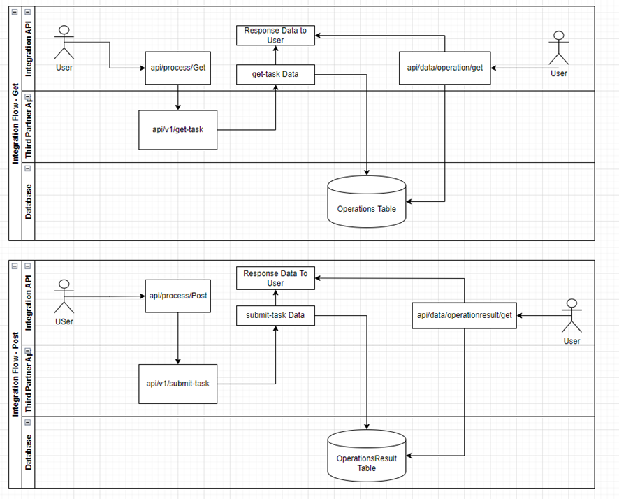

# ADP SBS/RS Interview preparation

[[_TOC_]]

## What we expect from you
During the interview, we expect that upon a pair review / Pair programming session, you can identify, changes, improvements, and weeks spots and then discuss and propose changes for the solution.  
You are not expected to code anything before the meeting. The solution will be presented to you as requested.  
  
## Problem Statement
  
Our team was asked to build an Integration API (described bellow) to display data from a third partner source.  
According to the Third Partner documentation, the integration API will execute a series of calls to consume data and then post data to the third partner. Then store these operations on a database and then return the result data.  
The current state of the APIs is that it has four endpoints. Two that execute the flow within the third partner API and can display the result, and two that return data from the database.  
The API is functional but not in a production state.  
  
## Integration API (the one that will be reviewed during the interview)
  
The code base is NET 6.  
  
There are two endpoints to communicate with the Third Partner API.  
  
**GET API/process**: Will communicate with the third partner, store the response in the database, and return the response data to the user.  

**GET API/data/operation/data**: Return the database records stored in the API/process get process.  
  
**POST API/process**: Receives the payload returned by the get API/process, submits this payload to the third partner post-Endpoint, stores the response, and returns the result to the user.  
  
**GET API/data/operation result**:  Return the database records stored in the API/process post-process.  
  

## Third partner Documentation
  
The API will make a call to an endpoint https://interview.adpeai.com/api/v1/get-task  
This Endpoint returns data related to an operation and the values used in the math operation.  
The response data are as follows.  
ID = Identifies the operation ID.  
Process = the mathematical procedure to be performed.  
Left is the left Value in the math formula.  
Right is the right Value in the math formula.  
  
Using the values returned from the Endpoint, the system should proceed with the Math operation and post the result to a second endpoint  https://interview.adpeai.com/api/v1/submit-task  
The post data will contain a JSON body where the properties will be:  
ID = the Id returned in the first Endpoint.  
Result = the Value returned from the mathematical operation determined by the first Endpoint.  

| Status Code |	Description                                    |
| :--------:  | -------                                        |
| 200         |	Success                                        |
| 400         |	Incorrect value in result; No ID specified; Value is invalid; |
| 404         |	Value not found for specific ID                |
| 503         |	Error Communicating with database              |
